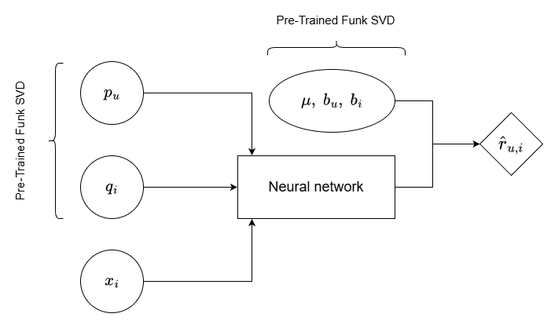
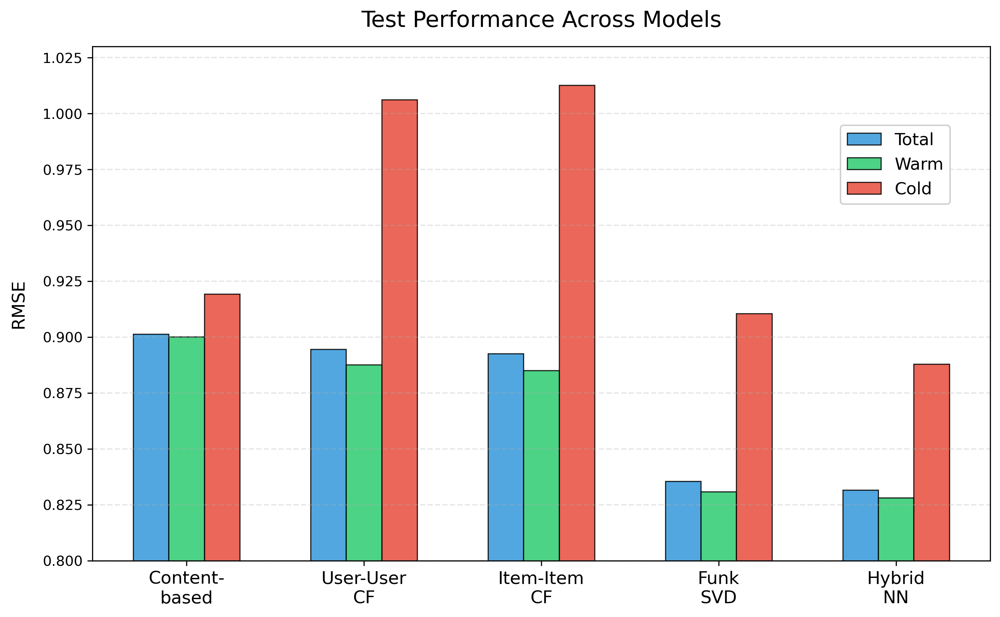

# Hybrid Movie Recommendation System

Exploration and evaluation of recommendation algorithms on the [MovieLens 20M dataset](https://grouplens.org/datasets/movielens/20m/) with the design and PyTorch implementation of a hybrid neural network that improves predictions for both popular and cold-start items.


📄[**Project Report**](reports/Hybrid_Movie_Recommendation_System_Report.pdf)


## Overview

As data tracking increases, recommendation systems have become a huge part of our digital lives. Every day, platforms like Netflix, Spotify, and Amazon recommend content tailored to our preferences and activity. While these systems work silently under users' notice, their construction and learning processes reveal distinct behaviors and limitations depending on the recommendation target and available data. To understand these trade-offs, this project systematically explains and compares four foundational approaches to recommendation prediction.

This project uses a subset of the MovieLens 20M dataset, resulting in over 850,000 ratings from roughly 6,000 users across 6,500 movies, along with metadata including genres and user-generated tags. After exploratory analysis and data cleaning, I systematically evaluated content-based filtering, memory-based collaborative filtering, and model-based matrix factorization. By analyzing the strengths and weaknesses of each approach, I then designed a hybrid neural network that addresses their individual limitations and leverages the complementary information available in the dataset.

The evaluation process follows a realistic scenario where each user's most recent ratings are predicted, simulating real-world deployment. Models were optimized through hyperparameter tuning on a validation set and rigorously evaluated on a held-out test set. Additionally, test performance was measured separately for warm-start movies (frequently rated) and cold-start movies (rarely rated), revealing how each algorithm handles varying levels of data availability.


## Hybrid Model Architecture 

As the main contribution of this comparative study, I designed a hybrid neural network that refines predictions from pre-trained Funk SVD by integrating content features. Rather than training embeddings from scratch or using a simple weighted combination, the model leverages the high-quality representations learned by Funk SVD, which performed best among baselines. The pre-trained user and item embeddings are combined with engineered content features (one-hot encoded genres, PCA-reduced tag scores, movie metadata, etc.) and fed into a feedforward network that learns non-linear refinements to the standard dot-product prediction. The network output is then combined with pre-trained global mean and user/item bias terms to form the final rating prediction. This approach maintains the strength of collaborative filtering on popular items while incorporating content signals to address cold-start scenarios where interaction data is sparse.

<br>

<p align="center">
  
  <br>
  <span style="font-size: 0.9em; font-style: italic;">
    Hybrid model architecture used to predict the rating $\hat r_{u,i}$ for user $u$ and movie $i$.
  </span>
</p>


## Key Findings

The systematic comparison reveals distinct strengths and trade-offs across recommendation approaches. Content-based filtering proved quick and efficient, handling cold items reasonably well by relying on movie features rather than interaction history. In contrast, memory-based collaborative filtering achieved moderate accuracy but faced computational scalability challenges due to the large similarity matrices required. Funk SVD emerged as the strongest baseline, offering better scalability and improved performance across all metrics through efficient matrix factorization. Building upon this foundation, the hybrid neural network integrated content features with pre-trained Funk SVD embeddings to achieve the best overall test RMSE of 0.8317. Most notably, the hybrid approach reduced cold-start error by approximately 2.5% compared to Funk SVD alone, demonstrating how content signals can refine collaborative predictions when collaborative signals are weak.

<br>

<p align="center">

</p>


## Repository Structure

```
movie-recommendation-system/
├── data/
│   ├── processed/               # Cleaned and preprocessed datasets
│   └── raw/                     # # Original MovieLens 20M data (not included, download separately at the provided link)
|
├── modules/                     # Core Python modules for data processing and modeling
│   ├── data_analysis.py         
│   ├── data_cleaning.py         
│   └── hybrid_NN.py
|             
├── notebooks/                   # Detailed exploration, implementation, and evaluation
├── reports/                     # Project report
|
└── environment.yml              # Conda environment for reproducibility
```

## License

MIT License
